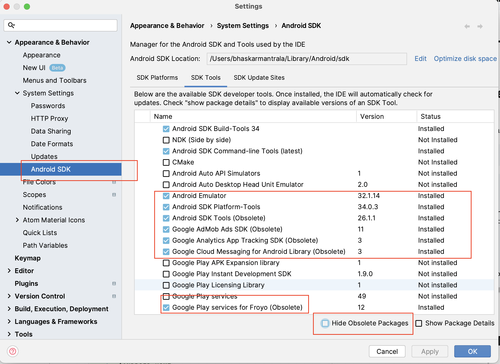
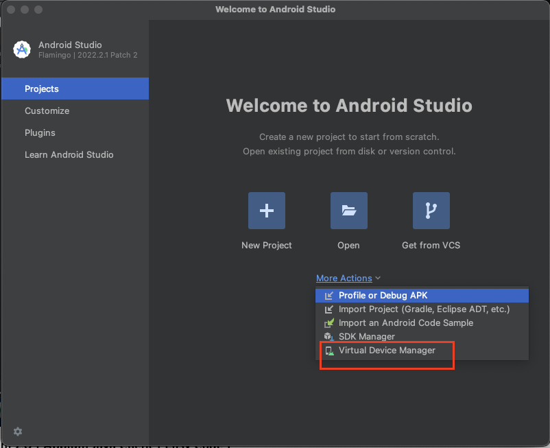

# Android Setup / Config

## Setup Android Environment (Download Android Studio instead)

Install required packages using following command:
> appium-installer

``` 
    👋 Hello, Appium user ✨
    
    ? Select an option (Use arrow keys)
    ❯ Need help setting up Android Environment to run your Appium test?
    Need help setting up iOS Environment to run your Appium test?
    Install Appium Server
    Install Appium Drivers
    Install Appium Plugin
    Run Appium Doctor
    Launch Emulators/Simulators
    (Move up and down to reveal more choices)
   ```

**[Android Environment Setup Logs](android-environment-setup.txt)**

## Set Android Home Path (Download Android Studio instead)

* Open Bash profile
```shell
  vim ~/.zshrc
```

* Set android path as below and save
```
    export ANDROID_HOME=/Users/$USER/Library/Android/sdk
    export PATH=$ANDROID_HOME/platform-tools:$PATH
    export PATH=$ANDROID_HOME/tools:$PATH
    export PATH=$ANDROID_HOME/tools/bin:$PATH
    export PATH=$PATH:$ANDROID_HOME/emulator
    export PATH=$ANDROID_HOME/build-tools/34.0.0:$PATH
    export PATH=$ANDROID_HOME/build-tools/34.0.0/bin:$PATH
```

## Download Android SDK from Android Studio / IntelliJ




* Update profile changes
```shell
  source ~/.zshrc
```
* Check Android home path
```shell
  echo $ANDROID_HOME
```

## Setup Android Emulator using Android Studio

Download Android Studio from here: https://developer.android.com/studio

## Setup Android Virtual Devices




## Android Debug Bridge (abd - command line tool)

> adb devices

> adb devices -l 