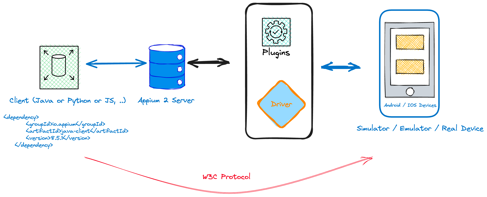

# appium2-java

## What is Appium?

## Appium 2 architecture?



## Requirements

https://appium.io/docs/en/2.0/intro/requirements/

* A macOS, Linux, or Windows operating system
* Node.js version in the SemVer range ^14.17.0 || ^16.13.0 || >=18.0.0
* NPM version >= 8 (NPM is usually bundled with Node.js, but can be upgraded independently)

## What is Simulator (IOS)?

## What is Emulator (Android)?

## What is Real device (iOS, Android, Windows, Mac)?

## Setup Appium Server CLI and Drivers (Android and IOS) using Appium Installer

Install Appium Installer from https://www.npmjs.com/package/appium-installer
   > npm i appium-installer -g

> **Use Space key to select option while installing packages**
## Install Appium Server (CLI)

**[Appium Server Installation Logs](appium-server-setup.txt)**

## Setup IOS Simulator using XCode

Download IOS Xcode from here: https://developer.apple.com/xcode/resources/

> Appstore app


## Setup Android and IOS drivers

**[Android and iOS Driver Setup Logs](android-ios-driver-setup.txt)**


| Driver Name                | Device  | Config                                                  |
|----------------------------|---------|---------------------------------------------------------|
| appium-uiautomator2-driver | Android | https://github.com/appium/appium-uiautomator2-driver    |
| appium-xcuitest-driver     | iOS     | https://appium.github.io/appium-xcuitest-driver/4.32.7/ |

All the drivers will be installed in this location:

> /Users/$USER/.appium/node_modules

## Setup Appium Plugins

**[Appium Plugin Setup Logs](appium-plugin-sample-setup.txt)**


## Setup Appium Java Client from Project pom.xml

> java-client **>8** version is required for Appium 2.0
```maven
    <dependency>
        <groupId>io.appium</groupId>
        <artifactId>java-client</artifactId>
        <version>8.5.1</version>
    </dependency>
```

## Check Appium version (Suppose to be 2.x)

```shell
appium -v
```

## Setup Appium Doctor

```shell
npm install appium-doctor -g
```

```
➜  appium-doctor -h

Usage: appium-doctor.js [options, defaults: --ios --android]

Options:
  --ios       Check iOS setup                             [boolean]
  --android   Check Android setup                         [boolean]
  --dev       Check dev setup                             [boolean]
  --debug     Show debug messages                         [boolean]
  --yes       Always respond yes                          [boolean]
  --no        Always respond no                           [boolean]
  --demo      Run appium-doctor demo (for dev).           [boolean]
  -h, --help  Show help                                   [boolean]
```

***********
## Setup Appium Inspector (Locator Finder)

Download from here - https://github.com/appium/appium-inspector/releases

> .dmg extension file for mac

**OR** use Selenide

Setup from here - https://github.com/selenide/selenide/tree/main/modules/appium

***********

## Start Appium Server (CLI)

> Server config can be updated from [Appium Config](.appiumrc.yaml)

> CLI Args - https://appium.io/docs/en/2.0/cli/args/

```shell
appium
```

## Desired capabilities (W3C Capabilities)

https://appium.io/docs/en/2.0/guides/caps/

> Appium client takes care of it (java-client 8.x version or above)

## Launch Simulator (IOS / Xcode)

> Xcode installs simulator app - Open from Applications

## Find list of devices on iOS Simulator

> xcrun simctl list

> xcrun simctl list devicetypes

## Android Setup

[ANDROID.md](ANDROID.md)